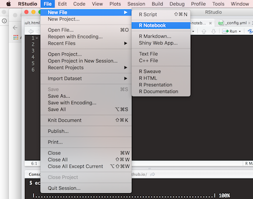
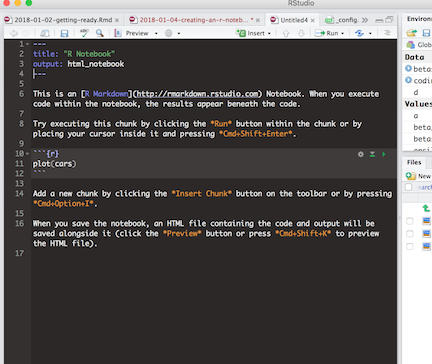
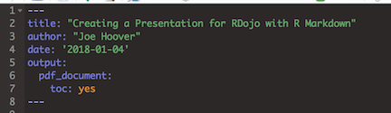

## RDojo Presentations

RDojo aims to be interactive, educational, and useful. To help achieve this, we ask that all RDojo presentations be accompanied by a fully-functional R Markdown file, all requisite data, and a PDF generated from that file. This ensures several things:

1. *Functionality.* To render a PDF from an R Markdown file, the code must be completely self-contained. If your code doesn't work, you cannot render a PDF. This helps make sure that your code *does* work, as well as increases the usability of your code for others. 

2. *Documentation*. Ever RDojo presentation will be posted to the RDojo blog. For this to happen, presentations need to be blog-ready. If all presentations are submitted in R Markdown format, then it is easy to convert them into a blog post. This helps ensure that attendees have easy access to functional code *and* that RDojo presentations are preserved for future use. 

## Working with R Markdown

While there are different frameworks for creating R Markdown, I think that R Notebooks are the most useful. Like all R Markdown files, they can easily be used to generate a markdown file for our blog, but, as you will soon see, they render output beneath code chunks. This feature is particularly useful for live presentations. 

### Creating an R Notebook

To create a new R Notebook, select *file* -> *New File* -> *New R Notebook* 





This will open a new R script that looks like this: 




There are three important components shown in the default script generated when you create a new R Notebook: a header, a code chunk, and markdown text.

1. **Header.** The header is the code at the top of the file preceded and followed by `---`. This provides meta- and formatting information that will be used when you render a document from your markdown.

2. **Code chunk.** A code chunk is the code preceded and followed by  \`\`\`. *Code chunks are where you put R code*. For example, the code `plot(cars)` is contained by the pictured code chunk. 

3. **Markdown.** Markdown is a simple language for generating HTML. It combines raw text with various formatting tags to generate documents. In addition to running R code, R Markdown and R Notebooks rely on markdown to generate text. There are many resources for learning markdown and you don't need to be an expert in order to make nice R Notebooks. Here is a good resource for getting started: [https://beegit.com/markdown-cheat-sheet](https://beegit.com/markdown-cheat-sheet). The linked content explains how to create bold and italicized text, lists, links, images, tables, etc. 

These three components are all that is necessary for creating an R Notebook. As your learning, it can be helpful to look at the R Notebook file used for generating a markdown document. For example, from the code for this file, you could learn basic formatting commands and how to automatically create a table of contents. 

### Working with code chunks


Code chunks themselves have two important components: 

1. **Paramaters.** You place these inside the `{r}` tag. Three important paramaters are: 
a. *name.* You really should name your code chunks because it helps users keep track of which chunks do what. To name your code chunk, just include the desired name after `r` in the tag: `{r name_here}`
b. *eval.* Should the code be evaluated (i.e. run) when the document is generated? The default is `TRUE`, meaning that code in code chunks will be executed by default. You can change this by setting `eval=FALSE` (i.e. `{r no_run, eval=FALSE}`). 
c. *echo.* Should the code chunk itself be printed (i.e. included) in the rendered document. Sometimes, you need to run code that needn't be included in the rendered document. You can exclude code chunks by setting `echo=FALSE`. The default is `TRUE`. 

A quick guide to code chunk paramaters (and R Markdown in general) is available [here](https://www.rstudio.com/wp-content/uploads/2015/02/rmarkdown-cheatsheet.pdf).

2. **Code.** Obviously, code chunks are for including code, whether you want to run it or not. You can put any R code in a code chunk and it will be handled by the rendering processing according to that chunk's paramater specifications. 

When you are working interactively with an R Notebook, you still need to put your code in code chunks. 

To create a new code chunk you can select *Code* -> *Insert Code Chunk* from the menu or you can use keyboard shortcuts: 
* Mac = Ctrl+Alt+I
* Windows = Command+Option+I

Code chunks also have several other nice features. For example, the green play button show in the above image will cause an entire code chunk to run. Also, when you are running code interactively, the output of the code will be displayed below that code's code chunk.


Here is an example of code and output generated by a code chunk: 

```{r example_1}
summary(cars)
plot(cars)
```

As you can see, two commands were run `summary(cars)`, which generated a summary table of the R dataset `cars` and `plot(cars)` which generated a plot of `cars`. 

## Rendering documents from R Notebooks

To render a document from an R Notebook, click the `Knit` button in the toolbar. If you open the drop-down menu for that button, you will see that you can select a format for the document. To Knit a PDF, simply click 'Knit to PDF'. 

## RDojo guidelines 

In addition to submitting R Notebooks and a rendered PDF for a RDojo submission, we ask presenters to follow several other guidelines: 

1. **Include a table of contents to simplify navigating the document.** To automatically generate a table of contents, you can copy the format of the header for this document: 



2. **Use a 'year-month-date-title' name for your R Notebook file** Using a common file name with a date helps keep everything organized. 

3. **Create a directory/folder for your presentation.** The name of this directory should be the same as the name of your R Notebook. This directory (and its contents) will be included in the RDojo github repository. 

4. **Put requisite data in a 'data' sub-directory.** If your notebook relies on data that is not available in an R package, please create a sub-directory called 'data' in your presentation folder and place the data there. 

5. **Include external images in an 'external_images' sub-directory** If you want to include screen captures or any other images *not* generated by your notebook, please include them in a sub-directory called 'external_images.'